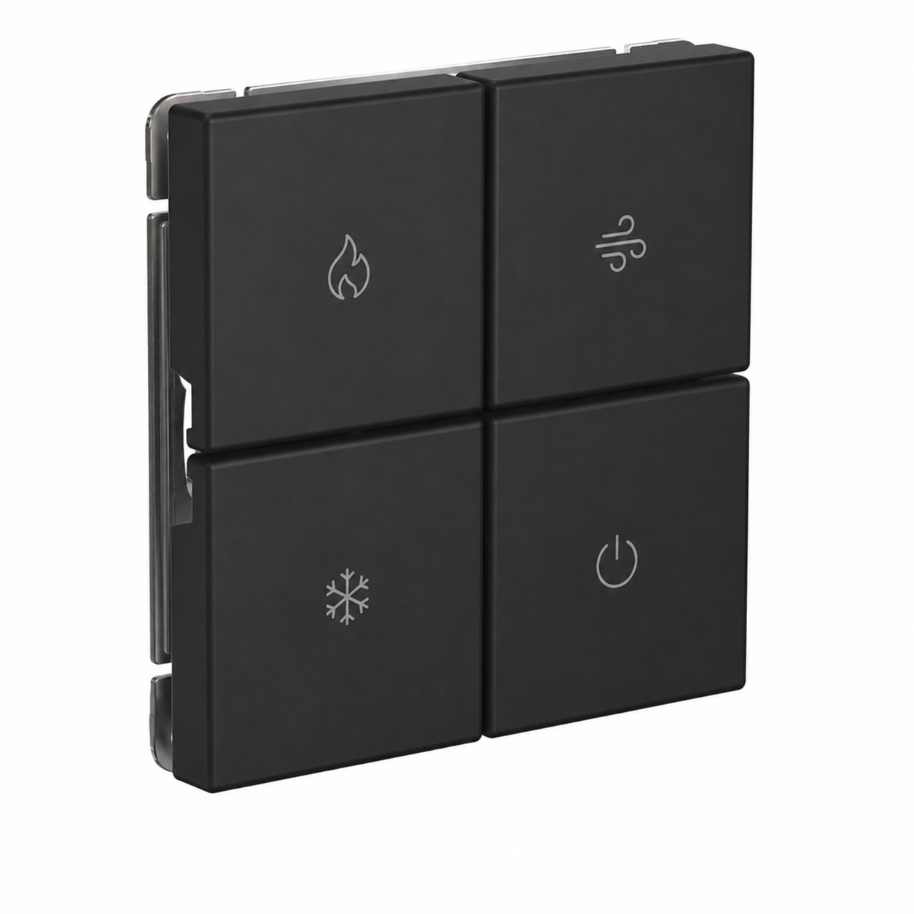

# AUX ArtGallery Climate Controller

Настенный контроллер кондиционера **AUX ASW-H18A4/BA-R2DI** через:

- UMDU AC AUX
- Home Assistant
- Shelly i4 Gen3
- Systeme Electric ArtGallery 4 клавиши

## Архитектура

```
Systeme Electric ArtGallery
        |
        v
Shelly i4 Gen3
        |
        v
Home Assistant
        |
        v
UMDU AC AUX
        |
        v
AUX ASW-H18A4/BA-R2DI
```

## Первый этап: интеграция AUX UMDU

Перед установкой настенного управления необходимо выполнить интеграцию кондиционера:

https://github.com/JuNglEKZN/instructions/tree/main/aux-umdu-home-assistant

После интеграции должна появиться сущность:

```yaml
climate.aux_living_room
```

---

# Настенная панель

**Systeme Electric ArtGallery**

Пример внешнего вида и расположения лазерной гравировки:



Раскладка:

```
┌──────────────┬──────────────┐
│      🔥      │      ≋       │
│     HEAT     │     FAN      │
├──────────────┼──────────────┤
│      ❄       │      ⏻       │
│     COOL     │    POWER     │
└──────────────┴──────────────┘
```

---

# Shelly i4 Gen3

| Канал | Клавиша |
|-|-|
| SW1 | 🔥 HEAT |
| SW2 | ≋ FAN |
| SW3 | ❄ COOL |
| SW4 | ⏻ POWER |

---

# Логика кнопок

| Кнопка | Одинарное | Двойное | Долгое |
|-|-|-|-|
| 🔥 HEAT | +1 °C | — | — |
| ❄ COOL | -1 °C | — | Turbo Cool |
| ≋ FAN | Fan speed | Swing ON/OFF | Угол жалюзи |
| ⏻ POWER | Вкл. / восстановление комфортного состояния | Sleep / Ночь | Выкл. |

---

# Automation Layer

Физические кнопки вызывают Home Assistant scripts.

Поток:

```
Shelly event
      |
      v
Automation
      |
      v
Script
      |
      v
Climate entity
```

Scripts:

```yaml
script.aux_restore_comfort
script.aux_turbo_cool
script.aux_cycle_fan
script.aux_toggle_swing
script.aux_cycle_angle
script.aux_sleep
```

---

# Установка

1. Настроить UMDU AC AUX.
2. Добавить кондиционер в Home Assistant.
3. Установить Shelly i4 Gen3.
4. Подключить ArtGallery.
5. Импортировать automations.
6. Проверить события single/double/long push.
7. При необходимости заменить временные entity_id на реальные.

---

# Статус

✅ Hardware architecture  
✅ ArtGallery layout  
✅ Button specification  
✅ Automation architecture  
⬜ Final entity names after installation
